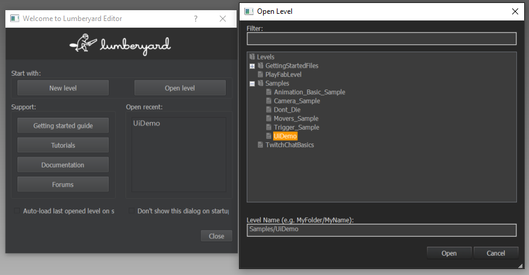
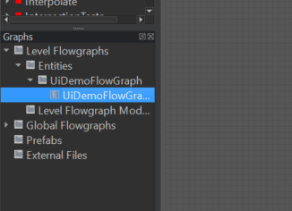
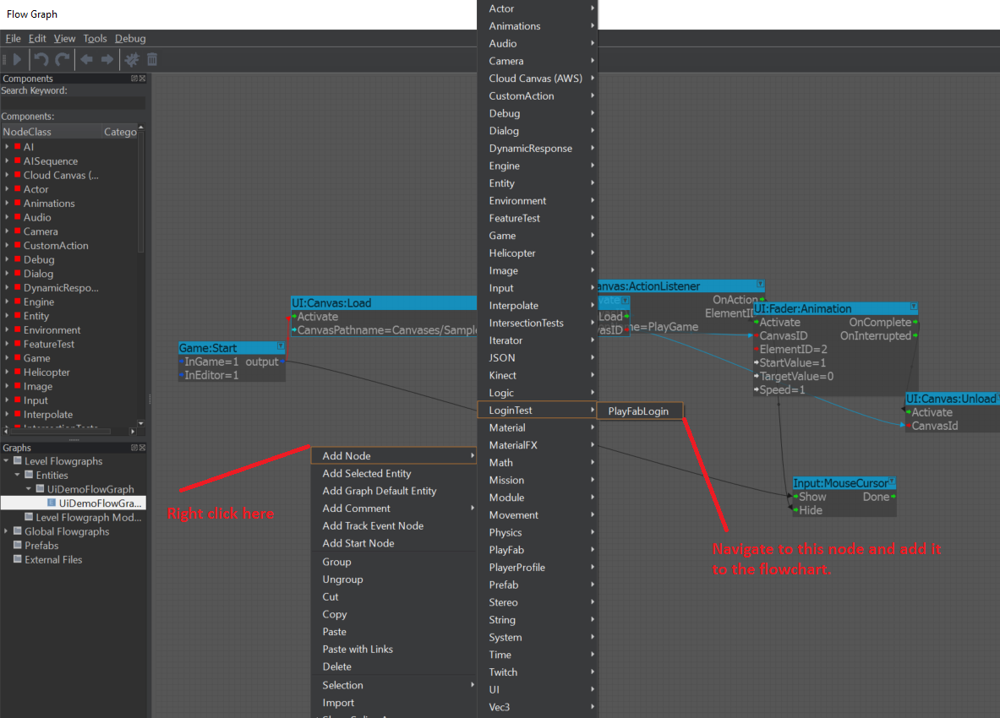
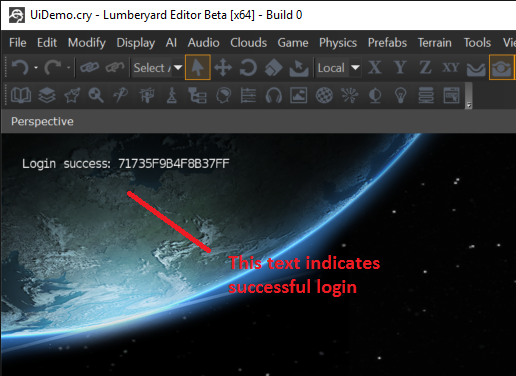

PlayFab Amazon Lumberyard SDK Getting Started Guide
========
Welcome to the PlayFab Amazon Lumberyard SDK.

In this guide, we will describe making your first PlayFab Api call using the PlayFabClientSdk.

1. Prerequisites:
----

1. [Install lumberyard](https://aws.amazon.com/lumberyard/downloads/)
2. Read and finish the "Programming" section in this link to learn how to set up your Lumberyard development environment: https://gamedev.amazon.com/forums/tutorials
3. Please follow steps 2 and 3 in the Readme to get Lumberyard and the PlayFab Sdk installed:
 * https://github.com/PlayFab/LumberyardSDK/blob/master/README.md#2-prerequisites
 * https://github.com/PlayFab/LumberyardSDK/blob/master/README.md#3-gem-installation
4. It is expected that you have read and understand all "Programming" tutorials on this page: https://gamedev.amazon.com/forums/tutorials

2. Your Lumberyard Gem
----

* There is an excellent tutorial on creating your own gem labeled "Creating A Gem With Code" on this page:
 * https://gamedev.amazon.com/forums/tutorials
* Before you proceed, you must have your own gem set up, and it is highly suggested you have a OnPostUpdate function printing text to the screen.
* After you have set up your own gem, Follow step 4 in the Readme to add a dependency to the PlayFabSdk gem, and enable PlayFab api calls in your gem:
 * https://github.com/PlayFab/LumberyardSDK/blob/master/README.md#4-gem-dependency
* At this point you are ready to make your first api call

3. Prepare your gem to report API-Call results:
----

This part of the guide is an extension of the "Creating A Gem With Code" Amazon tutorial.  You will add a static string to your gem, and update your OnPostUpdate function to print that string.

The code below is an example of how to change your tutorial Gem to print a statically defined block of text.  Later, we will modify that text with a PlayFab API call.

PlayFabApiTestGem.h (Rename "PlayFabApiTestGem" with your own gem name)
```
#pragma once

#include "IPlayFabApiTestGem.h"
#include <aws/core/utils/memory/stl/AWSString.h> // <--------- ADD THIS LINE
#include <IGameFramework.h>

namespace PlayFabApiTest
{
    class PlayFabApiTestGem : public IPlayFabApiTestGem, IGameFrameworkListener
    {
        ... other gem header code ...
        void OnPostUpdate(float fDeltaTime) override; // <--------- If you followed the tutorial, this line should already exist

        static Aws::String lastDebugMessage; // <--------- ADD THIS LINE TO YOUR GEM
    };
} // namespace PlayFabApiTest
```

PlayFabApiTestGem.cpp (Rename "PlayFabApiTestGem" with your own gem name)
```
... other gem code ...

Aws::String PlayFabApiTest::PlayFabApiTestGem::lastDebugMessage; // <--------- ADD THIS LINE

void PlayFabApiTest::PlayFabApiTestGem::OnPostUpdate(float fDeltaTime) // <--------- If you followed the tutorial, this function should already exist
{
    if (lastDebugMessage.length() > 0)
    {
        float white[4] = { 1.f, 1.f, 1.f, 1.f };
        gEnv->pRenderer->Draw2dLabel(32.f, 32.f, 2.f, white, false, lastDebugMessage.c_str());
        // If you followed the tutorial,
        //   you only need to change the text “Hello World Gem says hello.”, to:
        //   lastDebugMessage.c_str()
    }
}
```


4. Adding a login Api call to your gem:
----

In this section we will add the code that makes an API call, and activate that code.

* The documentation for how to build a flow node can be found here:
 * http://docs.cryengine.com/display/SDKDOC4/Creating+a+New+Flow+Node
* Note the Lumberyard eqivalent of this page does not exist yet, but these instructions are valid for the current release of Lumberyard.
 * You do not need in-depth familiarity of this document, as all the necessary code is provided below.

Modify your Gem.cpp file again, and add the following code:

PlayFabApiTestGem.cpp (Rename "PlayFabApiTestGem" with your own gem name)
```
... other #includes at the top of your file ...
#include <PlayFabClientDataModels.h> // <--------- ADD THIS LINE

... other gem code (the rest of the current file) ...

// ---------------- Add all of the code below to the end of your gem.cpp file ----------------
// (Optional/Advanced) If you are familiar with how to manage your waf-files, you can also create a new file

class CFlowNode_LoginTest : public CFlowBaseNode<eNCT_Instanced>
{
public:
    CFlowNode_LoginTest(SActivationInfo* pActInfo) {}
    virtual IFlowNodePtr Clone(SActivationInfo *pActInfo) override { return new CFlowNode_LoginTest(pActInfo); }
    virtual void GetMemoryUsage(ICrySizer* s) const override { s->Add(*this); }
    virtual void GetConfiguration(SFlowNodeConfig& config) override
    {
        static const SInputPortConfig in_config[] = {
            InputPortConfig<SFlowSystemVoid>("Activate", _HELP("Activate PlayFab Gem")),
            { 0 }
        };
        static const SOutputPortConfig out_config[] = { { 0 } };
        config.sDescription = _HELP("PlayFab LoginTest Gem");
        config.pInputPorts = in_config;
        config.pOutputPorts = out_config;
        config.SetCategory(EFLN_APPROVED);
    }
    virtual void ProcessEvent(EFlowEvent event, SActivationInfo* pActInfo) override
    {
        switch (event)
        {
        case eFE_Activate:
            PlayFabLogin();
            break;
        }
    }
    static void PlayFabLogin()
    {
        auto playFabSdkGem = GetISystem()->GetGemManager()->GetGem<PlayFab::IPlayFabSdkGem>();
        auto apiTestGem = GetISystem()->GetGemManager()->GetGem<PlayFabApiTest::IPlayFabApiTestGem>();
        if (!playFabSdkGem || !apiTestGem)
        {
            PlayFabApiTest::PlayFabApiTestGem::lastDebugMessage = "Error in project: Cannot find PlayFab Gem";
            return;
        }
        auto clientApi = playFabSdkGem->GetClientApi();

        playFabSdkGem->GetPlayFabSettings()->titleId = "6195"; // <-------------- Use your PlayFab titleId here
        PlayFabApiTest::PlayFabApiTestGem::lastDebugMessage = "Logging in...";
            PlayFab::ClientModels::LoginWithCustomIDRequest request;
        request.CreateAccount = true;
        request.CustomId = "PlayFabSdkTutorial";
        clientApi->LoginWithCustomID(request, LoginSuccess, LoginFail);
    }
    static void LoginSuccess(const PlayFab::ClientModels::LoginResult& result, void* customData)
    {
        PlayFabApiTest::PlayFabApiTestGem::lastDebugMessage = "Login success: " + result.PlayFabId;
    }
    static void LoginFail(const PlayFab::PlayFabError& error, void* customData)
    {
        PlayFabApiTest::PlayFabApiTestGem::lastDebugMessage = "Login failed: " + error.ErrorMessage;
    }
};

REGISTER_FLOW_NODE("LoginTest:PlayFabLogin", CFlowNode_LoginTest);
```

While following the Amazon tutorial instructions you should have already done several steps.  Double check them now:
* Your build configuration should be:  "[All] Debug" or "[All] Release"
* Your build platform should be: "x64"
* You should have set the "Sandbox/Editor" project as your startup project (in the the Solution/Sandbox folder, "Editor" project should be bold)

Finally, build and run your project:
* Dropdown->Build->Build solution.  The first time you do this, it will take a long time.
* Run the Editor project (Usually F5).  The first time you do this, the Asset Processor will appear, and will also take a long time.

These last steps are done in-editor.  We will be borrowing Amazon's existing UiDemo project, and slightly modifying it to perform our login.

* Use the screenshot below to open the Amazon UiDemo project:
* 
* Ignore and close any popup windows, errors, or warnings.  If you have not modified or broken the UiDemo project in other tutorials, they shouldn't affect this tutorial
* Select the dropdown menu: View->Open View Pane->Flow Graph.  This will open a new window.
* Use the screenshot below to open the UiDemoFlowGraph
* 
* Use the screenshot below to a PlayFabLogin flow node (This is the node we defined with the CFlowNode_LoginTest class)
* 
* Use the screenshot below to activate our PlayFabLogin flow node immediately when the game starts
* 
* Close the Flow Graph window, and return to the main editor window
* Press Ctrl+G to start the game
* If you see the text in the following screenshot, you have successfully logged a client into PlayFab using the LumberyardSdk
* 
* Congratulations!

You should note, the "request.CustomId" for this example is hard-coded.  For a real game, you may want to use a unique string as the customId for each player, or use one of our other [Client authentication apis](https://api.playfab.com/Documentation/Client) with proper information.  Editors note: I usually prefer [LoginWithEmailAddress](https://api.playfab.com/Documentation/Client/method/LoginWithEmailAddress), but Facebook, or device-specific logins are also very common/useful when possible.  You should only use [LoginWithCustomID](https://api.playfab.com/Documentation/Client/method/LoginWithCustomID) for testing, or when you can provide a guaranteed unique (and secure) string for every client running the game.  It is not suitable to use username as customID.  For that pattern, use [LoginWithPlayFab](https://api.playfab.com/Documentation/Client/method/LoginWithPlayFab).


5. Troubleshooting:
----

#### Contact Us
We love to hear from our developer community!
Do you have ideas on how we can make our products and services better?

Our Developer Success Team can assist with answering any questions as well as process any feedback you have about PlayFab services.

[Forums, Support and Knowledge Base](https://community.playfab.com/hc/en-us)


6. Copyright and Licensing Information:
----
  Apache License --
  Version 2.0, January 2004
  http://www.apache.org/licenses/

  Full details available within the LICENSE file.

